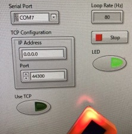

# lv_m5stickc_samples
M5StickC sample codes for LabVIEW.

## Requirements
* LabVIEW 2020  
* M5StickC
* [M5StickC ENV Hat](https://m5stack.com/products/m5stickc-env-hat)
* [lv_i2c_hal](https://github.com/miidas/lv_i2c_hal)
* [lv_i2c_linx](https://github.com/miidas/lv_i2c_linx)
* [lv_dht12](https://github.com/miidas/lv_dht12)

## How to run LED Test.vi?
First, you need to upload [LinxESP32M5StickC.ino](https://github.com/tanakamasayuki/LinxESP32/blob/master/examples/LinxESP32M5StickC/LinxESP32M5StickC.ino) to your M5StickC.  
Next, open LED Test.vi in LabVIEW, and then you need to specify a serial port or an IP address.  
Finally, click Operate->Run. When you click LED button in the front panel, the internal led of M5StickC will light up.  
Other VIs can be run in similar steps.  

